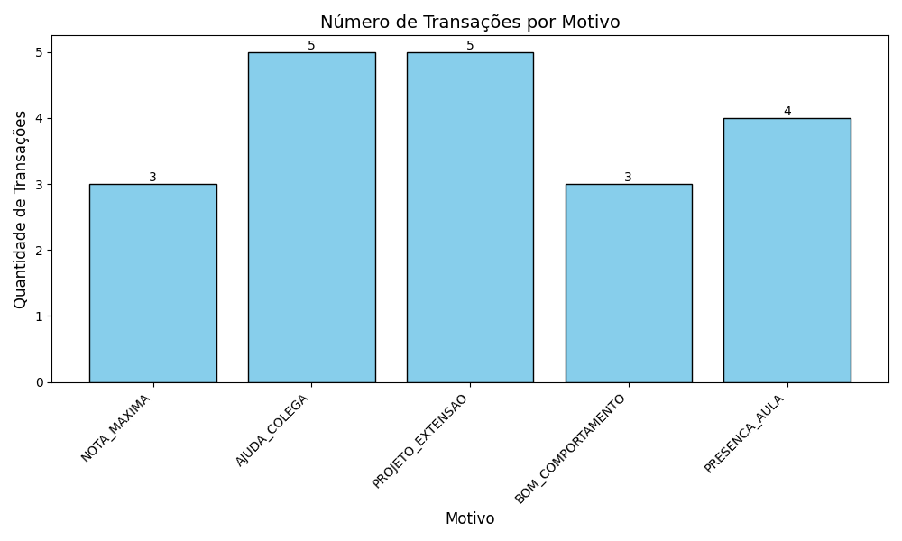
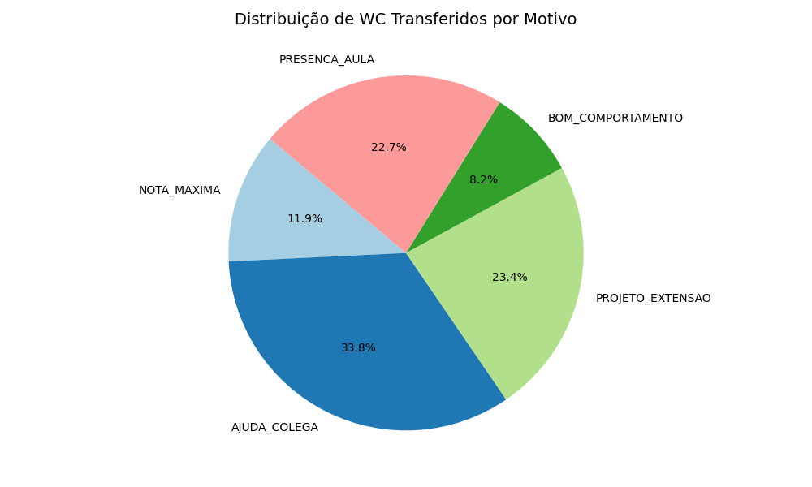

# Relatório de Desempenho e Distribuição (WydenCoin)

Este documento foi gerado automaticamente através da extração dos logs do Hyperledger Caliper.

## 1. Resumo de Transferências

- **Total de Transações Únicas Registradas**: 20
- **Total de Moedas (WC) Distribuídas**: 598 WC

### 1.1 Gráficos Gerados
Abaixo estão as representações visuais dos motivos que originaram as transferências na rede.

## 2. Métricas de Desempenho da Rede (Caliper)

Desempenho final consolidado por tipo de workload executado no teste:

| Workload | Sucesso | Falha | Send Rate (TPS) | Throughput (TPS) |
|----------|---------|-------|-----------------|------------------|
| **open** | 20 | 0 | 66.4 | 4.3 |
| **query** | 20 | 0 | 129.9 | 3.9 |

---
*Relatório gerado pelo script automatizado.*